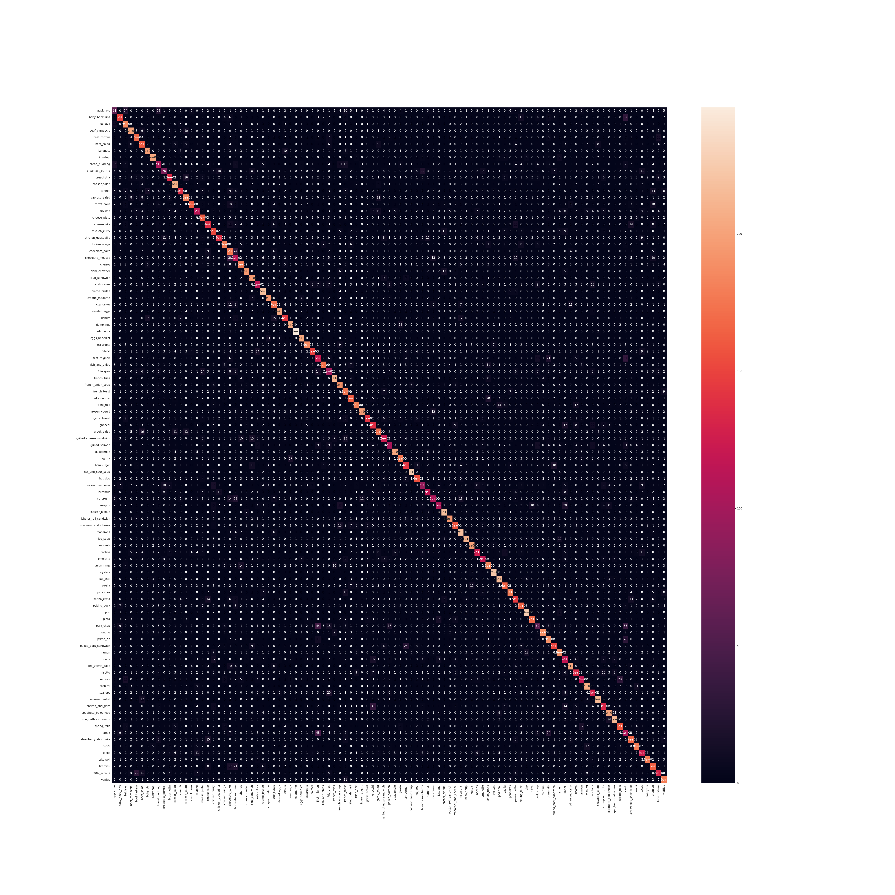

# Food 101

# Overview

This case study has the purpose of implementing a Convolutional Neural Network for Food101 dataset ang get more than 60% of accuracy don't using transfer learning.

# Result

<h6 align="center"> Confusion matrix infer in test set generated by the experiment.</h6>
