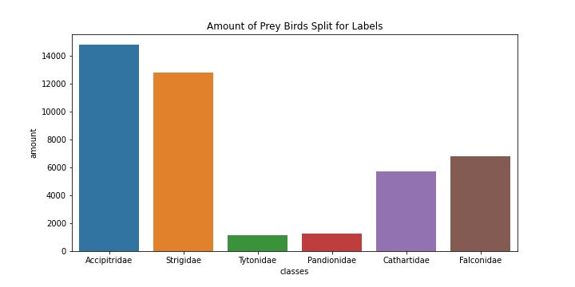

# Birds of prey

# Overview

This case study has the purpose of using two architecture of Deep Learning (MobileNetV2 and ResNet50) using the imagenet training, in other words, using
transfer learning technique. The most metric importance in this case study are f1-score because we have a unbalenced dataset. To have a better look of
the dataset, please check the image below.

<h6 align="center"> Class distribution.</h6>

# Result

<h6 align="center"> Confusion matrix infer in test set generated by the experiment.</h6>
